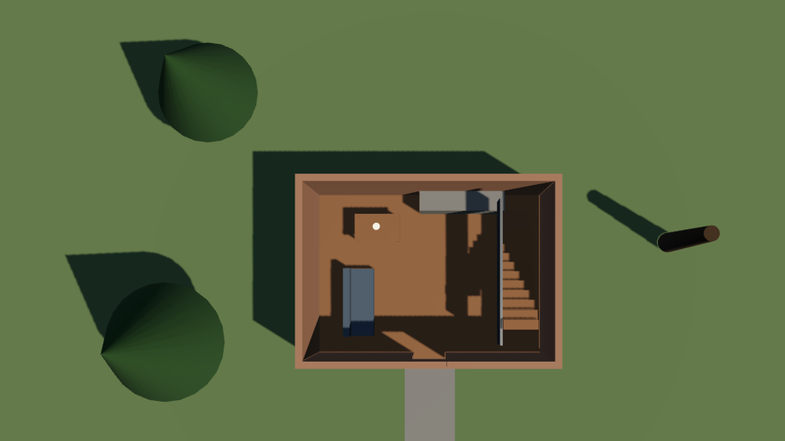
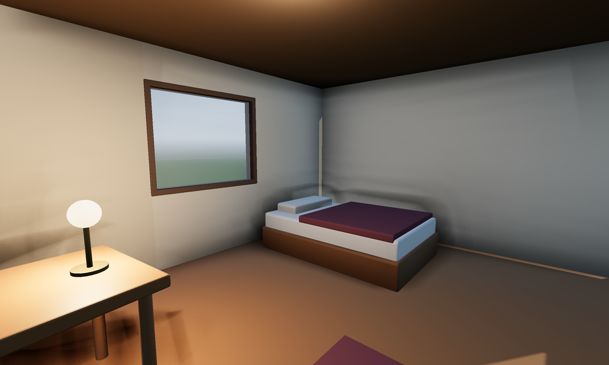
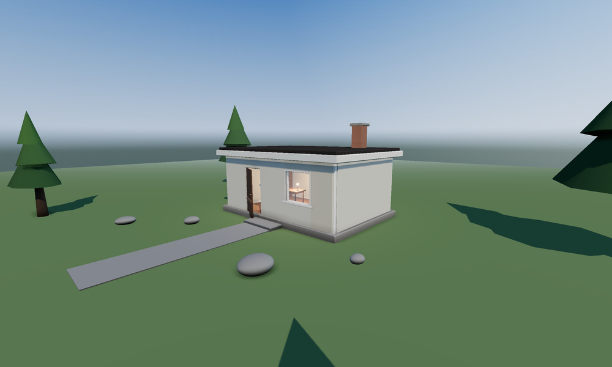
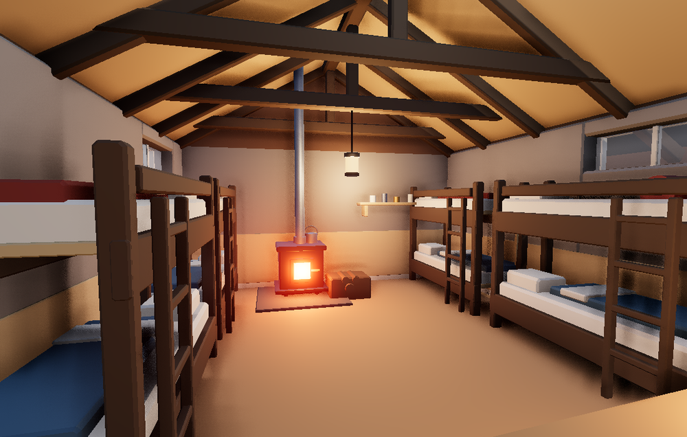
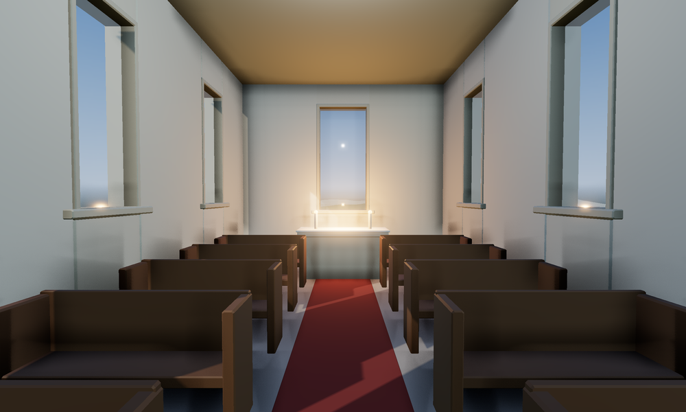
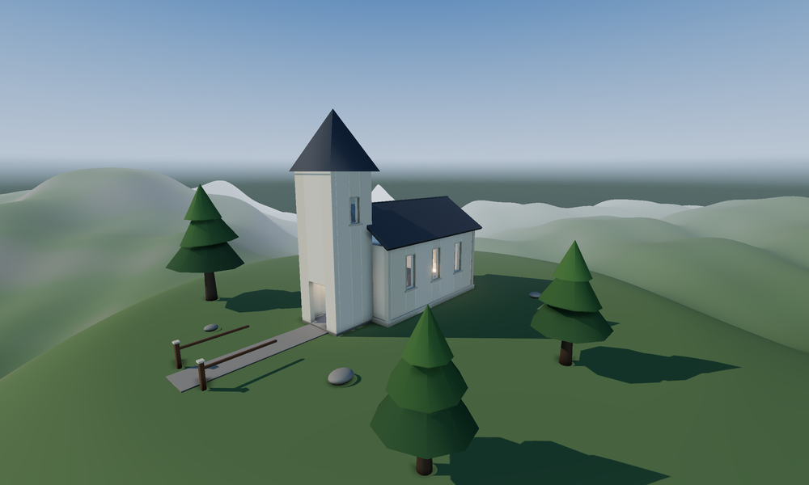
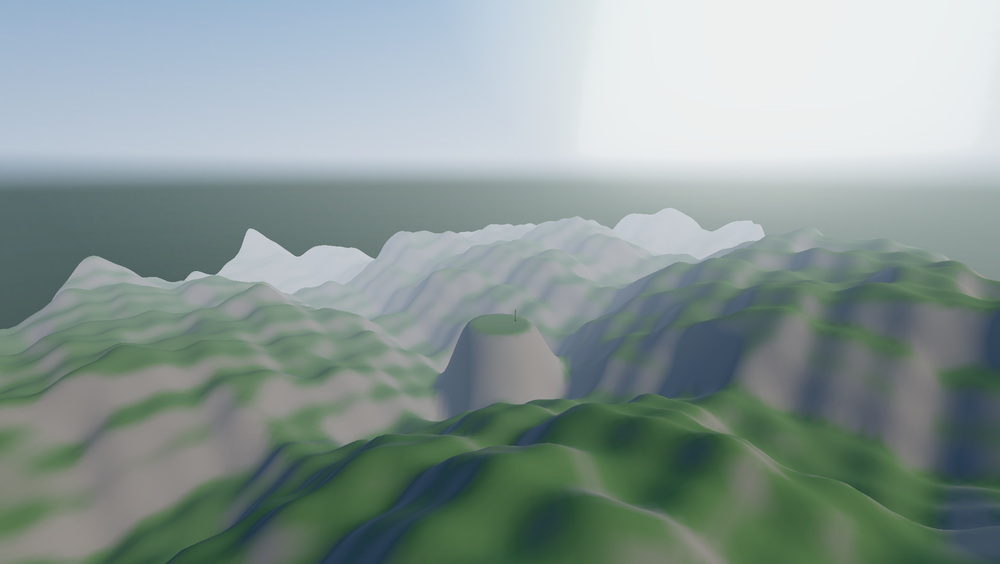
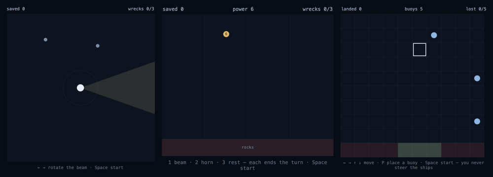
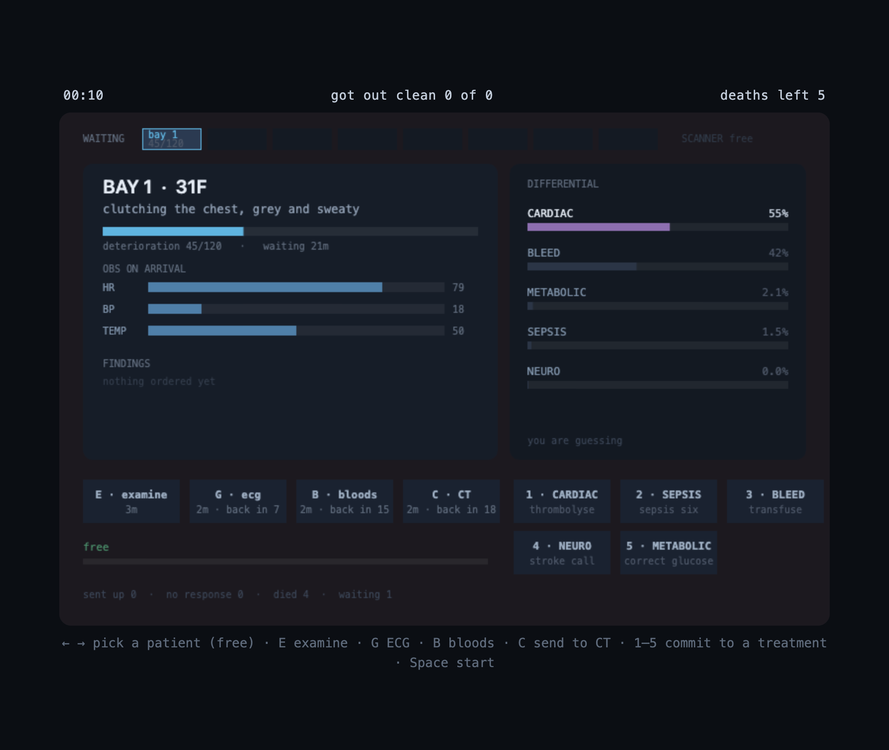
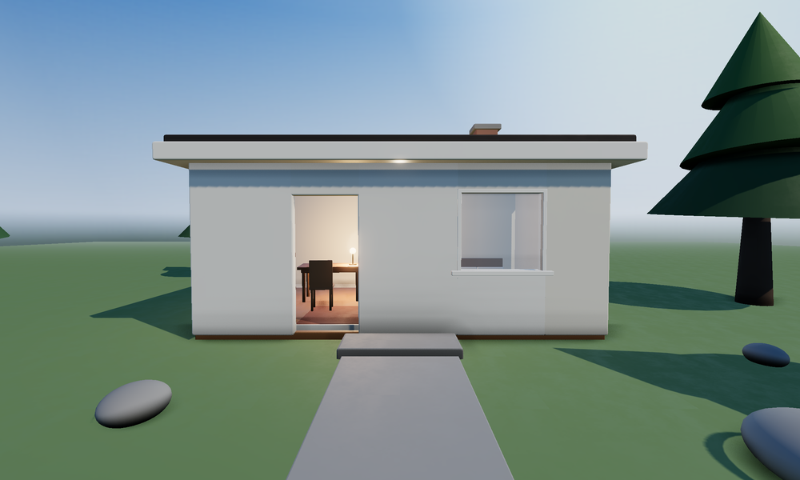

# claude-astra

Five Claude skills for work that happens outside a text editor: building 3D
scenes you can walk, prototyping playable games, driving native desktop apps,
matching a house document style, and verifying a front end by actually clicking
it.

Each is a self-contained directory — a `SKILL.md` with the method, `references/`
for the detail, and `scripts/` where the work is deterministic enough to
automate. Those scripts are dependency-free — Node driving headless Chrome over
the DevTools protocol, or Python standard library. Nothing to install.

<p align="center">
  
  <br><em>A scene <code>walkable-3d</code> built from one sentence, cut through at 2.6&nbsp;m — the only view that shows an interior, and the one the default six angles could not.</em>
</p>

| skill | does |
|---|---|
| [`walkable-3d`](walkable-3d) | prompt / photo / sketch → a walkable Three.js scene on generated terrain, structurally audited, exported to `.glb` with every object still named and separable for Blender or Unreal |
| [`playable-prototype`](playable-prototype) | one brief → several genuinely different browser game prototypes, each proven playable — and measured for whether the inputs carry a decision at all |
| [`frontend-qa`](frontend-qa) | verify a page at three widths and drive its real flows, then report what's broken with evidence |
| [`house-style`](house-style) | pull the house style out of the user's own documents — the palette *and* the writing — then check new ones actually match |
| [`desktop-app-driver`](desktop-app-driver) | operate native Mac apps through the accessibility tree — in the background, while the user keeps working |

## The thing they have in common

Each one is built around a verification loop, because in all five domains the
work *looks* finished long before it *is* finished. What each loop had to learn
to see:

**A generated 3D scene renders something**, and that something is usually
floating, hollow, or wrong-scaled in ways one screenshot hides. `walkable-3d`
audits the structure — it fails a build where the player would spawn inside a
wall, or where the ground would not hold them up — photographs six angles
because five of them are the ones you didn't think to check, and cuts a plan
through the roof, because a roofed building is opaque from all six.

**A click that silently no-ops produces the same screenshot as one that worked**,
so `frontend-qa` asserts on the DOM, the console and the network, never on
vibes — and computes the two failures people assume a tool cannot see, colour
contrast and focus visibility.

**A desktop action can report success and do nothing.** `desktop-app-driver`
treats four different result kinds as four different amounts of evidence, and
only one of them is a claim about the app at all.

**A game that renders is not a game that plays** — one of the four buttons does
nothing, or the score can never go up, and no screenshot shows it. So every
prototype `playable-prototype` produces exposes a small machine API, and a bot
plays it. Because the game is also deterministic and seeded, the bot can go
further and ask *what if I had pressed something else* — which measures whether
there is a decision in the game or only a seed.

**And "make it match our template" is guessing until you read the template** —
so `house-style` unzips it and takes the theme fonts, the palette, the size
ladder, the layout names, and the writing: words per slide, sentence length,
whether bullets end in a full stop, how long a heading runs.

## Verified

`./verify.sh` reproduces every claim below. 30 checks, no arguments, no setup —
it builds its own fixtures in a temp directory and cleans up after itself.

```
walkable-3d
  ok    audit passes on the bundled scene
  ok    audit fails a scene with the player trapped in geometry
  ok    shot.mjs renders a frame headlessly
  ok    audit fails a scene that does not hold the player up
  ok    a terrain scene audits clean and holds the player up
  ok    the player can walk across terrain in every direction
  ok    the player can walk in through the front door
  ok    audit catches a first draft with no lights, solid kerbing and a doorway too narrow to use
  ok    --plan cuts through the roof for an interior view
  ok    glTF export keeps object names and parenting
playable-prototype
  ok    the bundled game passes the playtest
  ok    playtest rejects a prototype with no API and one that is non-deterministic
  ok    playtest accepts a turn-based prototype that idles without advancing
  ok    playtest flags a prototype whose inputs carry no decision
frontend-qa
  ok    sweep passes a clean page
  ok    sweep catches console errors, overflow, broken images and duplicate ids
  ok    sweep flags a page with no viewport meta
  ok    sweep computes colour contrast and flags text below AA
  ok    sweep flags a control with no focus style, and not one that has one
  ok    sweep says outright that a canvas app is beyond what it can check
house-style (style.py runs on the standard library alone)
  ok    pdf: the reference matches its own spec
  ok    pdf: a drifted file is caught on face, colour and size
  ok    docx: a real Word file matches its own spec
  ok    pptx: a real PowerPoint file matches its own spec
  ok    docx: off-house face and off-ladder size are caught
  ok    pptx: off-house face, 16:9 geometry and off-ladder size are caught
  ok    prose: the house deck matches its own voice
  ok    prose: an off-voice deck is caught on density, sentences, punctuation, person and titles
  ok    a slide on a layout outside the house vocabulary is caught
  ok    one off-style slide among four conforming ones is caught, not hidden by the median
```

Every check is run **both ways** — a good input must pass and a deliberately
broken one must fail. A checker that only ever sees valid input is not a checker,
so each fixture comes in a matched pair: a scene that holds the player up and one
that does not, a deck in the house voice and the same three slides rewritten
wordy and first-person, a button with a focus ring and one with `outline: none`.

The `house-style` Office fixtures are the Word and PowerPoint templates bundled
with `python-docx` and `python-pptx`, which are genuine Microsoft Office output
(`Application=Microsoft Macintosh Word 14.0000`), plus generated decks and
documents carrying charts, tables, notes and page breaks. `style.py` itself is
run by the system `python3` on the standard library alone, so the no-dependency
claim is checked at the same time. Those two libraries are only needed to *build*
the fixtures; without them the Office checks are skipped with a note, never
silently passed. Same for PyMuPDF and the two PDF checks.

### What the checks do not cover

No skill's *judgement* is tested here, only its tooling. `verify.sh` proves the
audit catches a trapped spawn — not that a scene looks good; proves the sweep
catches an overflow — not that a page is usable; proves the playtest catches a
dead input — not that a game is fun.

`desktop-app-driver` is absent from `verify.sh` and always will be: it drives the
user's own machine through a permission dialog, so there is nothing to automate.
It is instead **driven by hand**, and every claim it makes has been checked
against a real app. Four are written up as measured profiles — Calculator,
TextEdit, Activity Monitor and Preview — in
[`references/app-profiles.md`](desktop-app-driver/references/app-profiles.md).

### Handing each skill to a session that had nothing else

The surest way to find out whether a skill carries on its own is to give it, and
a one-line brief, to a session with none of the context that built it — and to
ask that session to be blunt about what was wrong. Four were tested this way
(`desktop-app-driver` cannot be: it drives the user's own machine through a
permission dialog).

Each of them produced good work, and each returned a list of faults in the
tooling that the author could not see. `walkable-3d` gave up seven, including a
documented invocation that wrote into the installed skill and a distance-framing
failure that returned a blank white image indistinguishable from a broken scene.
`house-style` was handed a clean first pass, did not believe it, and built canary
files to test the checker — proving that the layout comparison its own reference
calls "worth more than any colour value" did not exist, and that every prose
check was a median that one bad slide could hide behind. `frontend-qa` found that
its own documentation manufactured false bugs: synthetic key events do not reach
the page at all until something clicks it first, so a tester following the skill
literally files "Space doesn't start the game" against working code.

`playable-prototype` was given *"a few prototypes about a night shift on a
ward"*, built four that varied on pressure, information and the character of
failure, and then caught the harness contradicting itself: a comment saying the
lookahead player decides every 15 ticks, and a call passing 30. It had already
retuned one of its own games — sizing a bay at exactly 30 ticks of walking — to
escape a false reading, and wrote: *"That is the measuring instrument dictating
the design, which is backwards."* It also found that the documented turn-per-tick
ratio was wrong by a factor of fifteen, which had been quietly handicapping every
turn-based prototype the skill produced.

All of it is fixed, and most of it is now a check in the list above.

## What running them found

Every skill here was used, not just written, and each one turned out to be wrong
about something. These are the corrections worth knowing even if you never touch
the repo.

**A tool that reports success is not reporting evidence.** A desktop click that
returns `ok (AXPress on AXButton '모드')` can change nothing at all; one that
returns `ok (delivered via raw input … unverified)` is the tool saying outright
that it could not confirm anything. Activity Monitor keeps its entire process
table *out* of the accessibility tree — 35 elements, every one of them toolbar
chrome — so you read that content off the screenshot and drive the app through
the controls that are exposed.

**Verify in the environment you are verifying, not the one you assume.** A
headless page throttles `requestAnimationFrame` to a stop, so a wall-clock check
of a walk simulation under-reports a fall and a DOM read of a canvas game reports
frozen counters against working code. A headless page is also never
window-focused, so `:focus` never matches and a focus-visibility check is
confidently wrong on every page it sees unless you turn focus emulation on.
Synthetic key events arrive without `e.code`, so a handler written the common way
silently never fires while the tool still reports the key as pressed.

**Order matters more than coverage.** A page with no `<meta name="viewport">` is
laid out at ~980px on a phone: nothing overflows, and every width-based finding
in the report was measured in a viewport that is not on screen. A prototype whose
runs are non-deterministic cannot be asked whether an input did anything. In both
cases one unchecked precondition was quietly invalidating everything downstream.

**The bug the screenshots were hiding.** `walkable-3d`'s frame loop computed
`dt` from a `requestAnimationFrame` timestamp that can precede the
`performance.now()` it was seeded with. The first `dt` was negative, gravity
added *upward* velocity, and the player was flung out of the world before the
first frame drew — so every screenshot for weeks was taken from underground with
the scene frustum-culled to almost nothing, and an earlier "freeze the sim for
capture" change had hidden it rather than fixed it.

**A clean run answers the question it was asked, not the one you have.** A game
prototype passed every check — playable, deterministic, no dead inputs, a
lookahead player scoring 10x random — while its dominant strategy was to ignore
every mechanic it had. Each check was true; all of them are about a *random*
player. Two rounds of fixes later every strategy scored the same, because the
thing that actually separated them was harm and the score was not looking at it.
A prototype whose score does not move with the thing the game is about will read
as balanced, deterministic, playable and deep, and still not be a game about that
thing.

**Measuring the thing people call unmeasurable.** Density, sentence length and
title style were documented as needing a human to read the samples. `"Q3 Revenue"`
against `"We are delighted to report that third quarter revenue grew
substantially"` is not a matter of taste a tool must stay out of — it is 1 word
against 11.

## Install

Copy a skill directory into `~/.claude/skills/`:

```bash
git clone https://github.com/didrod205/claude-astra.git
cp -r claude-astra/walkable-3d ~/.claude/skills/
```

Or point Claude Code at the checkout and invoke a skill by name.

## Using them

These are skills, not CLIs — you ask Claude in plain language and it runs the
loop. The commands under each are what it actually executes, and every output
block below is real, copied from the session that built and dogfooded these.

### walkable-3d

> *"Make me a two-storey townhouse I can walk into and go up the stairs."*
> *"이 사진으로 걸어다닐 수 있는 3D 씬 만들어줘"*

It lays the scene out on a metre grid first, writes `scene.json`, then audits and
photographs it until both are clean — the manifest is the deliverable, so
iterating means editing numbers, not rewriting code.

```bash
node walkable-3d/scripts/audit.mjs      scene/
node walkable-3d/scripts/walk.mjs       scene/                # can you MOVE through it?
node walkable-3d/scripts/shot.mjs       scene/ --out shots --plan 2.6 --plan 5.4
node walkable-3d/scripts/serve.mjs      scene/ --open        # walk it yourself
node walkable-3d/scripts/export-glb.mjs scene/ --out house.glb
```

```
audit - townhouse
  67 objects (25 solid) - 60.0 x 7.8 x 60.0 m - 58 draw calls - 8k tris

  ok - no structural problems
```

You get `scene/` (three files), six angles plus a cutaway plan per storey in
`shots/`, and a `.glb` whose objects keep the names you gave them — `w_g_s_l`,
`step_07`, `balc_rail_n` — so a person can open it in Blender and move the bed.

**The audit knows what a first draft gets wrong.** Walls but no light object
(the interior will render black), trim marked solid (a 26 cm fence around your
own building), a gap between two wall slabs under 0.7 m (nobody fits through) —
each of those cost an iteration to find by hand, and each is now reported before
you render anything.

**Standing is not walking.** `walk.mjs` holds W in eight directions and reports
how far the player got, how much they climbed, and whether they ever ended up
below the ground:

```
    0°    9.23 m   climb  0.14 m   end y   1.84   on ground
   90°   15.60 m   climb  0.85 m   end y   0.91   on ground
```

At the walk speed of 2.6 m/s, six seconds is 15.6 m — anything much shorter means
something stopped them. It is the only check that catches a building you cannot
enter, which the bundled cabin was for several revisions: its own door leaf, ajar
at 26°, left 12 cm of a 1 m opening. Plenty to look at, impossible to walk
through.

**Add `--plan` for anything with an interior.** A roofed building is opaque from
all six default angles — this is what the six show you instead:

<p align="center">
  
  <br><em>The bundled example scene from inside — image-based sky light, ambient occlusion in the corners, and a lamp that is an actual light rather than a glowing sphere.</em>
</p>

<p align="center">
  
  <br><em>And from outside, on a heightfield levelled where the building sits. A plinth to sit the walls on the ground, corner boards to break the facade, a door leaf ajar so the lit interior shows through — none of it texture.</em>
</p>

<p align="center">
  
  <br><em>Built by a session that had only this skill and a one-line brief — no other context. The audit was clean on the first run; <code>walk.mjs</code> found a bench blocking the doorway, and the shot tooling had to be fixed before its images were usable at all.</em>
</p>

<p align="center">
  
  <br><em>A second scene, built from scratch to test whether the guidance works on a first pass. Warm candlelight against cool daylight, six windows with reveals, pews in four parts, a runner up the aisle.</em>
</p>

<p align="center">
  
</p>

<p align="center">
  
  <br><em><code>kind: "terrain"</code> — seeded value noise, vertex colours blended by slope, and discs you flatten so a building has ground to stand on. It is a mesh, so it is walkable without doing anything else.</em>
</p>

### playable-prototype

> *"Prototype a game about a lighthouse keeper — a few different directions."*
> *"이 아이디어로 프로토타입 3개 뽑아줘"*

It picks directions that differ on an axis that changes how the thing *plays* —
reflex vs. deliberation, direct vs. indirect control — builds each as one
self-contained HTML file, then has a bot play all of them.

```bash
node playable-prototype/scripts/playtest.mjs prototypes/ --out shots --ticks 1200 --seeds 5
```

```
playtest — 3 prototype(s), 1200 ticks, 5 seeds

  ok  a-beam   random 12 (7–13 over 5 seeds) · random 8 vs lookahead 10 over 3 seeds (1.2x) · 2/2 actions live · 11 ms/1000t
  ok  b-watch  random  5 (2–9 over 5 seeds)  · random 5 vs lookahead 28 over 3 seeds (5.6x) · 3/3 actions live · 15 ms/1000t · turn-based
  ok  c-buoys  random 14 (12–14 over 5 seeds) · random 8 vs lookahead  9 over 3 seeds (1.1x) · 5/5 actions live · 19 ms/1000t

  3 clean · 0 with warnings · 0 not playable
```

<p align="center">
  
  <br><em>One brief, three directions — reflex, turn-based deliberation, indirect placement. Not three reskins.</em>
</p>

The bot holds every declared input and fails the ones that change nothing, runs
the same seed twice and fails a disagreement, and plays at random across several
seeds to check the game can be scored in at all — and that the *seed* is not
quietly deciding the outcome.

**The last number is the one worth having.** A prototype is deterministic and
seeded, so *"what if I had pressed something else"* has an exact answer: replay
from the seed with a different next action. Comparing a player that does that
against one pressing at random measures whether the inputs carry a decision —
the question a prototyping pass exists to answer, and not one you can get by
playing the thing once.

The warning is deliberately **not** a threshold on that ratio. One greedy choice
per fifteen ticks against a random tail is a weak player, so a ratio near 1.0 is
normal for a game with real decisions in it — `c-buoys` above sits at 1.1x and is
fine. An earlier rule that flagged anything at or under 1.0x was catching three
sound prototypes out of four. What is actually diagnostic is a lookahead player
that **never wins on any seed**, and that is what gets flagged now, with both of
its causes named: no decision, or a payoff slower than a shallow lookahead can
see.

You can drive any prototype the same way:

```js
__game.seed(7); __game.reset(); __game.start();
__game.input('right', true); __game.step(60); __game.state()
```

**Past the first clean run.** Everything above measures a prototype against a
*random* player, which is the right question for *is this playable* and the wrong
one for *is the thing I built the thing being played*. A prototype from a
different run — one of four about a night shift on a ward — was developed further
to find out how far a clean run goes. The answer is: not very.

<p align="center">
  
  <br><em><code>examples/differential</code> — the panel on the right is a real posterior, and a calibration run says so. It claimed 69% across 271 commitments; a correct treatment settles a patient four times in five, so an honest panel predicts 55% settling. 54% settled.</em>
</p>

It passed the harness on its first build — no warnings, a lookahead player
scoring **10x** random. The number was worthless. The dominant strategy at the
time was to ignore every mechanic in the game and press a treatment button until
something worked.

Nothing generic can catch that; it needs instruments that know what your game
claims about itself. Three are written up, with what each one caught, in
[`examples/differential/`](playable-prototype/examples/differential/):

| instrument | the question | what it caught |
|---|---|---|
| **calibration** | is a number the game shows the player *true*? | the posterior read 55% where the answer was 40% |
| **economy** | what does each purchase actually buy? | free evidence already gave 78% — every test, the scanner and the clock were a rounding error |
| **policy race** | do the decisions matter? | "never order anything" beat working patients up, 37 a night to 30 |

The policy race is the one to write first if you write only one. It caught three
separate failures in the same table, and the third is invisible from every other
angle: after two rounds of fixes **every policy scored the same**. What differed
was harm — 19 a night against 10 — and the score was not looking at it.

### frontend-qa

> *"QA this before I ship it."* · *"이거 왜 안 눌려?"* · *"테스트해줘"*

Two halves. The sweep is one command; the flows are a browser session where each
action is followed by re-reading the DOM, the console, and the network.

```bash
node frontend-qa/scripts/qa-run.mjs http://localhost:3000 --out qa
node frontend-qa/scripts/qa-run.mjs ./dist --widths 390,768,1440 --json
```

```
qa sweep - http://127.0.0.1:56392/
  390px - 1 error(s), 1 warning(s)

  every width
    x [viewport] no <meta name="viewport"> — the phone lays this out at 980px and scales it down
    ! [a11y] 0 visible <h1> on the page
```

```
  x [contrast] 3 text element(s) below WCAG AA: p.faint 2.07:1 (needs 4.5) "This paragraph is too light to read."
  ! [contrast] 1 element(s) sit on an image or gradient — contrast not verifiable, check by eye
  ! [a11y] 1 control(s) show no visible change when focused: button.bare
```

Findings identical at every width print once, so responsive breakage stands out
from real breakage. Read `viewport` and `console` first — until those are clean,
nothing else in the report means what it says.

Contrast and focus visibility are the two failures people assume a tool cannot
see. Both are computable: contrast from the text colour and the first opaque
background above it, focus by comparing an element's computed style before and
after focusing it. Where the background is an image or a gradient the tool says
so and declines rather than guessing.

### house-style

> *"Write the Q3 deck in the same style as these three."*
> *"우리 템플릿 유지해서 보고서 하나 써줘"*

Give it two or three of your own files. It reads the theme rather than guessing
at it, and checks the finished file back against what it read.

```bash
python3 house-style/scripts/style.py extract deck.pptx report.docx -o style.json
python3 house-style/scripts/style.py check  draft.pptx --spec style.json
```

```
house style from 1 sample(s): house.pptx

  fonts     Arial, Calibri
  palette   #000000 #FFFFFF #1F497D #EEECE1 #4F81BD #C0504D #9BBB59 #8064A2
  sizes     9.0, 12.0, 14.0, 18.0, 20.0, 24.0, 28.0, 32.0, 40.0, 44.0 pt
  slide_in  [10.0, 7.5]
  layouts   Title Slide, Section Header, Two Content, Comparison, Title Only …
  prose     9 words/slide · sentence 3 w · 3.0 bullets/slide · 0% end in a full stop · headings 1 w

style check — 1 file(s) against house.json

  x [font] typefaces not in the house set: Impact
  x [geometry] slide_in is [13.33, 7.5] but the house style is [10.0, 7.5]
  ! [density] 78 words per slide against a house average of 9 — more than twice as dense
  ! [sentences] median sentence is 22 words against the house 3
  ! [punctuation] house blocks do not end in a full stop; these mostly do
  ! [voice] first person appears 110x per 1000 words; the samples barely use it
  ! [titles] headings run 11 words against the house 1 — the samples label, these assert
```

**It measures the writing too, not only the colours.** Density, sentence length,
whether blocks end in a full stop, how much first person appears, and how long a
heading runs — a deck titled *"Q3 Revenue"* and one titled *"We are delighted to
report that third quarter revenue grew substantially"* are not the same house,
and the difference is a number. Density is the constraint most likely to be
quietly ignored, which is why it is checked rather than described.

The `docx` / `pptx` / `xlsx` skills write the file; this one decides what goes in
it and proves it matches. The layout names are worth more than any colour value —
building slides from the deck's own layouts is what makes it look native.

### desktop-app-driver

> *"Lay this schematic out in KiCad."* · *"이 앱에서 직접 해줘"* · *"설치하고 테스트해줘"*

No scripts — it is method plus per-app knowledge, driving the computer-use tools
in the **background**, so the target window never comes to the front and you keep
working. Grant by bundle id, target by accessibility index, prefer the menu bar,
and screenshot after every step.

```
request_access({ apps: ["com.apple.calculator"] })        → tier full
app_screenshot                                            → image + [N] AX summary
app_ax_find({ role: "AXButton" })                         → 25 buttons, Korean titles
app_batch([ click 모두 지우기, 1, 2, 곱하기, 7, 등호, screenshot ])
   → All 7 actions ok; display reads 84
app_menu({ path: ["보기", "공학용"] })                     → switched mode
```

Results come in four kinds and only one is even a claim about the app —
`ok (AXPress on ...)` ran a real accessibility action; `ok (delivered via raw
input ... unverified)` is the tool telling you it could not confirm the click;
`ineffective` and `unsupported(canvas)` speak for themselves. So every batch ends
in a screenshot. And a background write often never reaches the app's undo stack,
so `overwrite_existing` returning the old value is your only undo.

Four apps are written up as measured profiles rather than guesses — Calculator,
TextEdit, Activity Monitor and Preview — in
[`references/app-profiles.md`](desktop-app-driver/references/app-profiles.md).
The most useful thing they establish: **a whole class of app keeps none of its
content in the accessibility tree.** Activity Monitor's process table is absent
from it entirely, 35 elements and every one of them toolbar chrome. You read that
content off the screenshot and drive the app through the controls that *are*
exposed — typing into its search field filtered a table the tree never described.

## Try it without asking Claude

```bash
./verify.sh                                                   # all 30 checks, ~9 min
node walkable-3d/scripts/serve.mjs walkable-3d/assets/template --open
open playable-prototype/assets/template/game.html
```

<p align="center">
  
  <br><em>The bundled example scene, from where you spawn. Click, then WASD.</em>
</p>

## Requirements

Node 22+ and a Chrome, Chromium, or Edge install. The scripts find the browser
themselves; set `CHROME_BIN` to override. `walkable-3d` renders through software
WebGL by default so it works headless anywhere — which is portable and slow:
**set `W3D_GL=angle` to use the real GPU** for anything you intend to look at,
and `--scale 1` when you only need to know that a frame rendered. `house-style` is Python 3 standard library only, plus PyMuPDF if you want to
read PDF samples. `desktop-app-driver` is macOS-only and needs the computer-use
tools.
